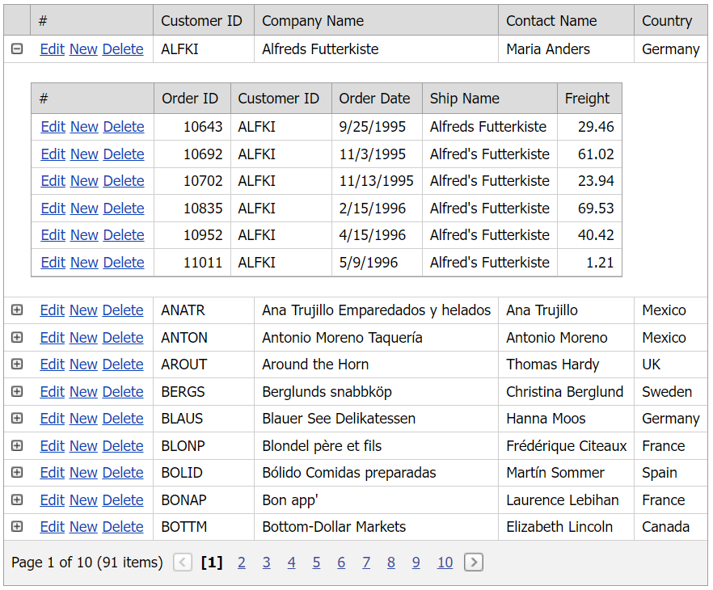

# Grid View for ASP.NET Web Forms - Simple master-detail implementation
<!-- run online -->
**[[Run Online]](https://codecentral.devexpress.com/e248/)**
<!-- run online end -->

This example demonstrates how to use a detail row template to display master-detail data.



## Overview

Follow the steps below to enable the master-detail functionality:

1. Create a master [Grid View](https://docs.devexpress.com/AspNet/DevExpress.Web.ASPxGridView) control, bind it to a data source, and enable the grid's [ShowDetailRow](https://docs.devexpress.com/AspNet/DevExpress.Web.ASPxGridViewDetailSettings.ShowDetailRow) property.

    ```aspx
    <dx:ASPxGridView ID="masterGrid" runat="server" AutoGenerateColumns="False" DataSourceID="SqlDataSourceCustomers" KeyFieldName="CustomerID" ... >
        <!-- ... -->
        <SettingsDetail ShowDetailRow="True" />
    </dx:ASPxGridView>
    ```

2. Specify the master grid's [GridViewTemplates.DetailRow](https://docs.devexpress.com/AspNet/DevExpress.Web.GridViewTemplates.DetailRow) property and add a detail grid to the template. Bind the detail grid to a data source and handle the grid's server-side [BeforePerformDataSelect](https://docs.devexpress.com/AspNet/DevExpress.Web.ASPxGridBase.BeforePerformDataSelect) event. In the handler, call the grid's [GetMasterRowKeyValue](https://docs.devexpress.com/AspNet/DevExpress.Web.ASPxGridView.GetMasterRowKeyValue) method to obtain the key value of the corresponding row in the master grid.

    ```aspx
    <Templates>
        <DetailRow>
            <dx:ASPxGridView ID="detailGrid" runat="server" AutoGenerateColumns="False" DataSourceID="SqlDataSourceOrders"
                KeyFieldName="OrderID" OnBeforePerformDataSelect="detailGrid_BeforePerformDataSelect" ... >
                <!-- ... -->
            </dx:ASPxGridView>
        </DetailRow>
    </Templates>
    ```

    ```csharp
    protected void detailGrid_BeforePerformDataSelect(object sender, EventArgs e) {
		Session["CustomerID"] = (sender as ASPxGridView).GetMasterRowKeyValue();
	}
    ```

3. Handle the grid's server-side [RowDeleting](https://docs.devexpress.com/AspNet/DevExpress.Web.ASPxGridView.RowDeleting), [RowInserting](https://docs.devexpress.com/AspNet/DevExpress.Web.ASPxGridView.RowInserting), and [RowUpdating](https://docs.devexpress.com/AspNet/DevExpress.Web.ASPxGridView.RowUpdating) events to configure the grid's edit functionality.

## Files to Review

* [Default.aspx](./CS/Default.aspx) (VB: [Default.aspx](./VB/Default.aspx))
* [Default.aspx.cs](./CS/Default.aspx.cs) (VB: [Default.aspx.vb](./VB/Default.aspx.vb))

## Documentation

* [Master-Detail Relationship](https://docs.devexpress.com/AspNet/3773/components/grid-view/concepts/master-detail-relationship)
